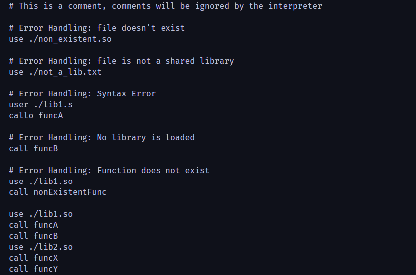
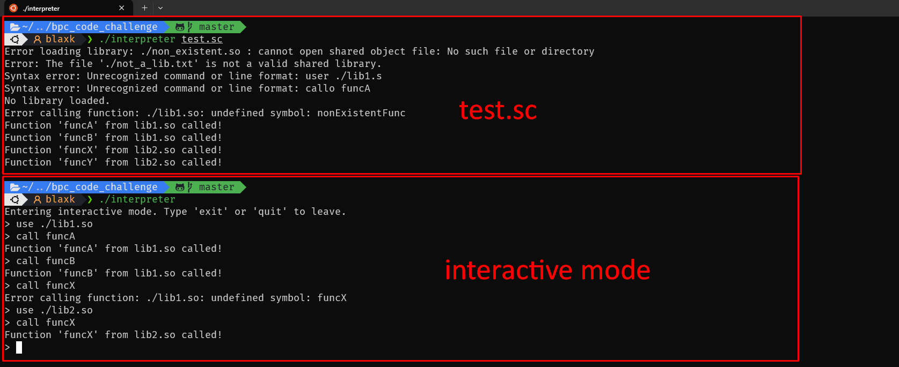

# BPC Code Challenge

This repository contains a solution for the BPC Code Challenge. The main focus is on creating an interpreter capable of handling dynamic shared libraries in C. The interpreter can load shared libraries, call functions within them, and provide appropriate error handling.

## Features

- **Dynamic Library Handling:** Capable of dynamically loading `.so` shared libraries at runtime using `dlopen`, `dlsym`, and `dlclose` functions.
- **Function Execution:** Ability to execute functions from the dynamically loaded shared libraries.
- **Error Handling:** Provides meaningful error messages for various potential issues like non-existent `.so` file, calling non-existent functions, and more.
- **Interactive Mode:** A mode where commands can be entered and executed directly.

## Prerequisites

Before running the interpreter, ensure you have the following prerequisites installed:

### **GCC (GNU Compiler Collection):** GCC is used for compiling C programs.

nstalation:

- **For Debian-based Linux distributions (like Ubuntu):**
    
    ```bash
    sudo apt update
    sudo apt install gcc
    ```
    
- **For Red Hat-based Linux distributions (like Fedora):**
    
    ```bash
    sudo yum install gcc
    ```
    
- **For macOS:**
    
    Ensure you have [Homebrew](https://brew.sh/) installed, then
    
    ```bash
    brew install gcc
    ```
    

### **Dynamic Linker (`libdl`)**

**`libdl`** is used for dynamic linking, which allows the program to load and call functions from shared libraries during runtime.

It usually comes pre-installed with most Linux distributions. If not, it can be installed as part of the **`libc6-dev`** package on Debian-based distributions.

## ****How to Compile****

1. **Compile Shared Libraries**:
If you have separate C files that you want to compile as shared libraries, use the following command:
    
    ```bash
    gcc -shared -o [name_of_library].so [name_of_source_file].c
    ```
    
    Example:
    
    ```bash
    gcc -shared -o lib1.so lib1.c
    gcc -shared -o lib2.so lib2.c
    ```
    
2. **Compile the Interpreter**:
    
    ```bash
    gcc -o interpreter interpreter.c -ld
    ```
    
    This command compiles the **`interpreter.c`** file into an executable named **`interpreter`**. The **`-ldl`** flag links the program with the dynamic linker.
    

### **Command Explanations**

- **`gcc`**: This is the GNU C Compiler. It's used to compile C programs.
- `-o`: This flag specifies the output file name.
- `-shared`: This flag is used to create a shared library instead of an executable.
- `-ldl`: Links the program with the dynamic linker library, allowing it to load shared libraries at runtime.

## **How to Run**

1. Run the interpreter with your script file:

    This method requires a `.sc` script file with the commands you wish to execute.
    
    ```bash
    ./interpreter [script_file_name].sc
    ```
    Example:
    
    ```bash
    ./interpreter sample.sc
    ```

2. Run the interpreter in Interactive Mode:

    If you run the interpreter without providing a script file as a parameter, you will enter the interactive mode. In this mode, you can type commands directly into the console.
    ```bash
    ./interpreter
    ```

## **Testing Scripts**

- `test.sc`: This script demonstrates the basic functionality by loading two libraries and calling functions from each, this also manage empty lines, comments and do some intentional errors to see how the error handling works.

## **Libraries**

- `lib1.c`: Contains functions `funcA` and `funcB` which prints a message that the function is being called
- `lib2.c`: Contains functions `funcX` and `funcY` which prints a message that the function is being called

## **Test Results**


